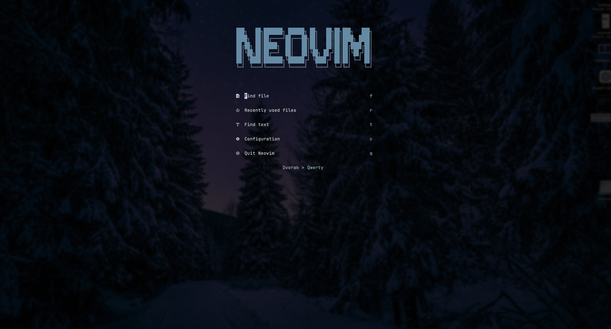
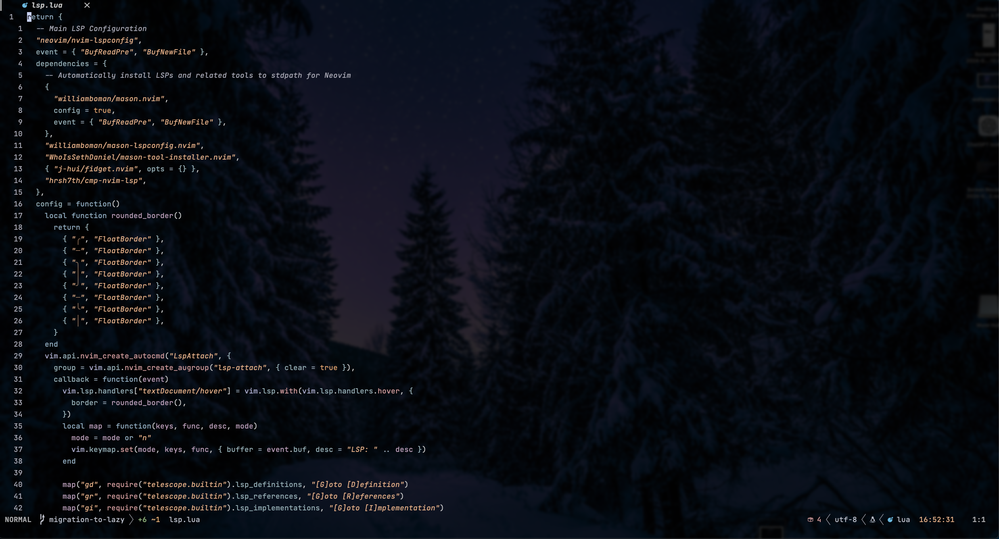

# Vim Configuration ⚙️

I use this neovim config as my daily editor for work, feel free to add suggestions,
copy what you want or open issues.

## 2024-09-24

My config was fully migrated to lazy package manager from packer.
I highly recommend this, my startup time was improved from 140ms to 50ms

## TODO 📝

Now everything works as I want :star:
