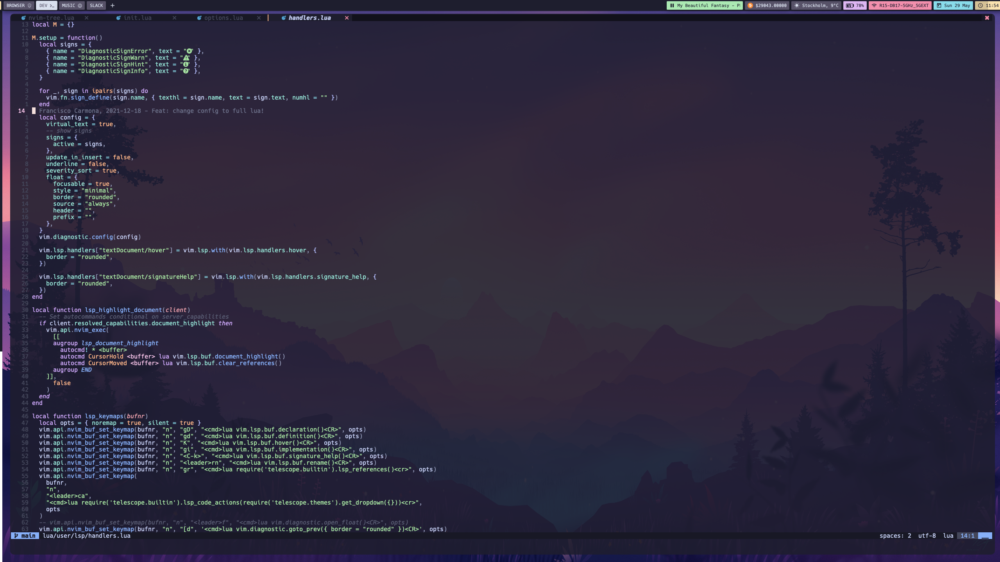

## Vim Configuration ⚙️

This repo contains my neovim configuration. Feel free to use it or to add a PR for improvements.

Everything is written in LUA 🌘

## TODOS 📝

- Refactor alpha.lua line 7, right now I'm using a hardcoded username so in the future if I use another one it will create errors (I always forget about this when using a new machine).

- Replace packer with lazy.nvim 

- Replace null-ls with conform.nvim and nvim-lint

